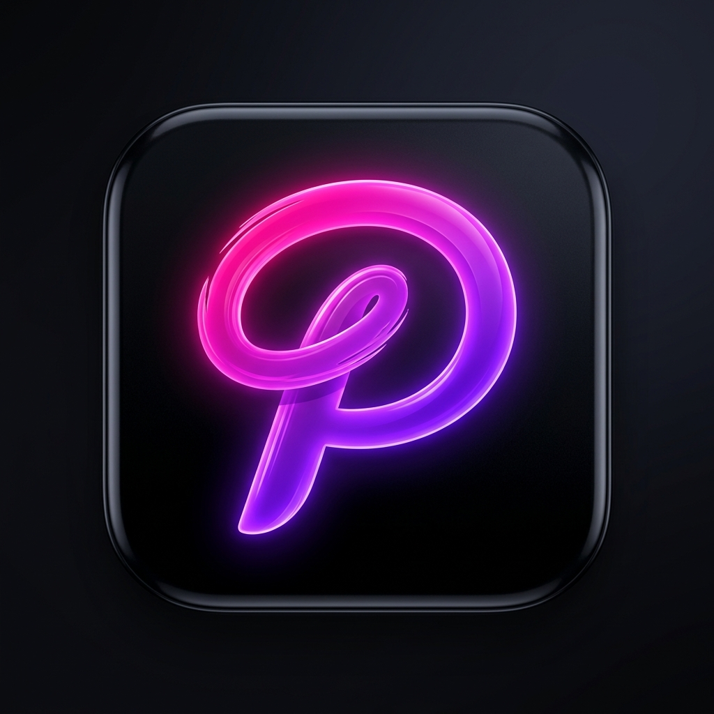
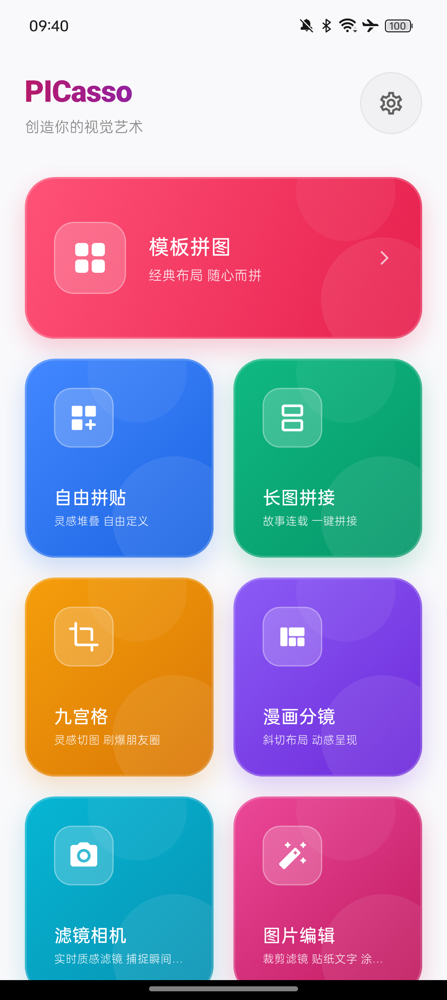
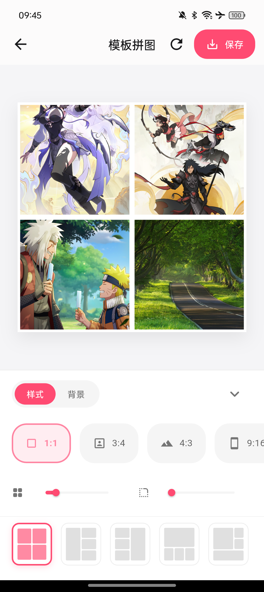
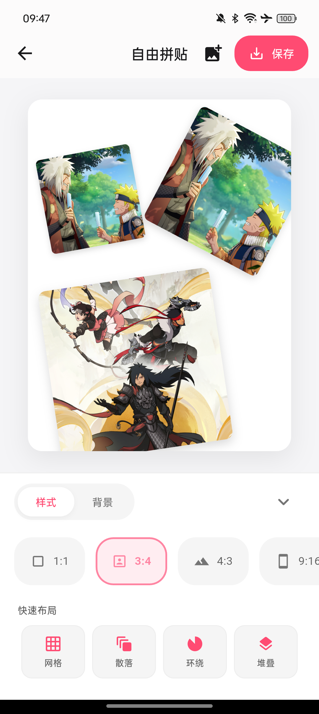
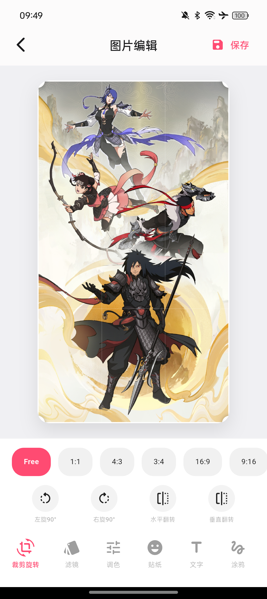
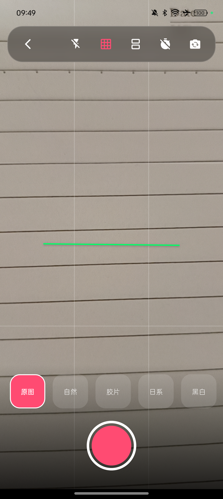
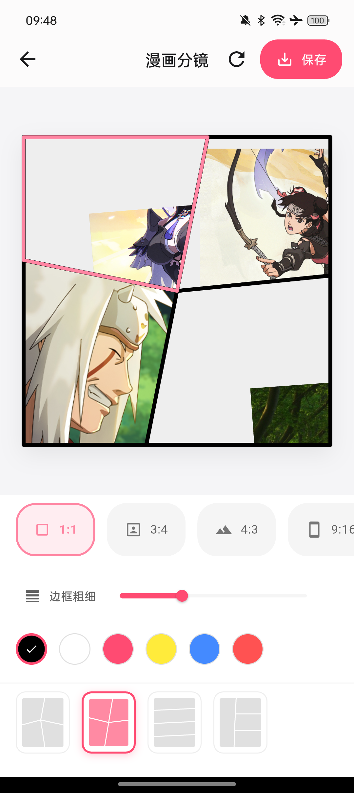
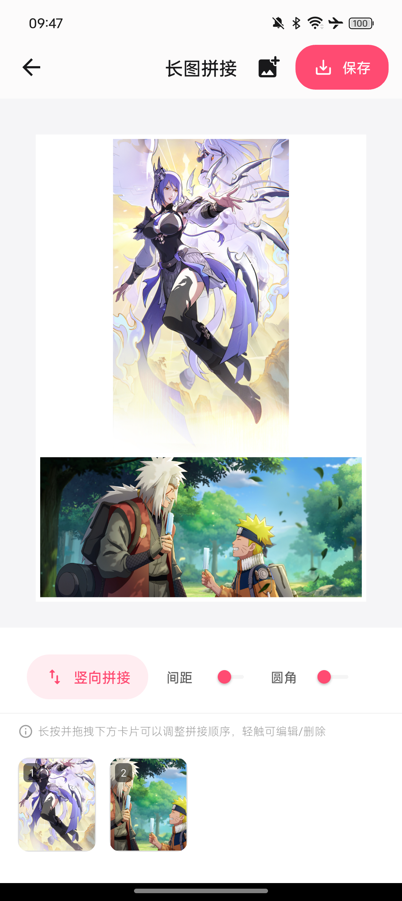
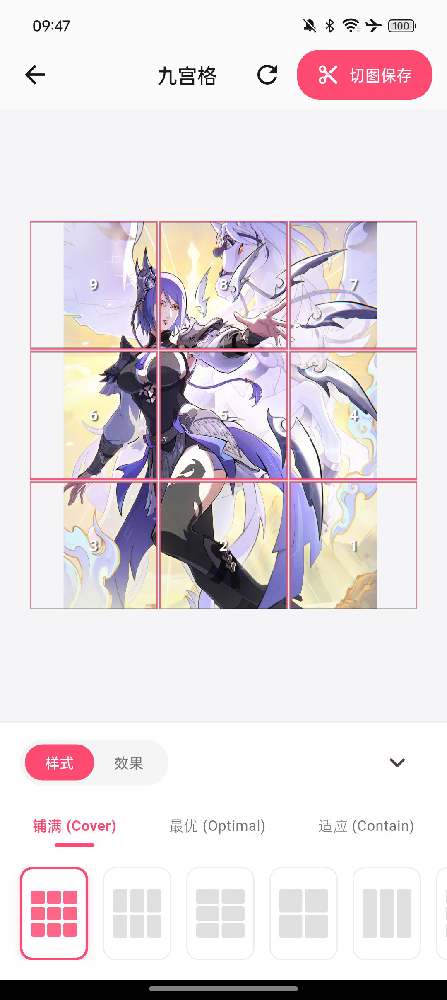
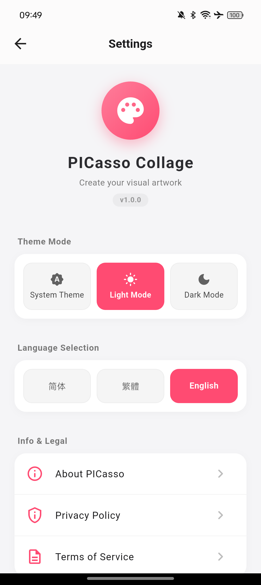

#  PICasso Collage

**PICasso** is a state-of-the-art, premium creative collage and photo editor application. Inspired by artistic aesthetics, it combines fluid, physics-based animations, glassmorphic UI elements, and a complete suite of editing capabilities into a seamless 60/120fps experience.

---

## 🎨 Screenshot Gallery

  
  
  

  
  
  

  
  
  

---

## ✨ Core Features

### 1. Modern Dashboard & Fluid Transitions
* **Asymmetric masonry card deck** styled with harmonious, vibrant gradients.
* **Tactile Touch Feedback (`_BouncyCard`)**: Features physics-rich elastic bounce animations—compressing down on tap-down and springing back with custom curves (`Curves.easeOutBack`) on release.
* **Expanding Route Navigation**: Custom transitions combine staggered scaling, fading, and micro-overshoots for a premium card-expansion effect when launching tools.
* **Scroll-driven Glassmorphic Header**: Interpolates status bar height, font sizes, subtitle opacity, and background blur filters dynamically as you scroll down.

### 2. Premium Image Editor Suite (P-图)
* **Unclipped Crop Box**: Real-time corner resize handles that overflow canvas borders to remain easily draggable at coordinate extremes. Features ratio locks (`Free`, `1:1`, `4:3`, `3:4`, `16:9`, `9:16`).
* **Sized Rotation Viewport**: Explicitly sizes rotated canvas stacks to avoid ratio-squeezing, ensuring tall/wide pictures expand to maximum available size.
* **Double-tap Inline Text Editing**: Double-tap text elements to edit text. Supports minimum layout constraints, cursor memory, and non-overlapping viewports.
* **Zero-Latency Gestures**: Move overlays cleanly with one-finger dragging, or rotate and scale dynamically with fluid two-finger pinch-to-zoom gestures.
* **15 Artistic Filters**: Real-time presets (Vintage, Lomo, Sepia, Vivid, Pastel, B&W, and more).
* **Advanced Color Toning**: Interactive brightness, contrast, and exposure matrix modifiers.
* **Smooth Doodle Canvas**: Custom brush colors and widths, with a transparent eraser mode (`BlendMode.clear`) to wipe doodle strokes cleanly.
* **Skin Beautifier**: Real-time whitening and stackable Gaussian blur filters.

### 3. Template Collage Editor
* **Smart Layouts**: Automatically creates grid templates for 1 to 9 selected photos.
* **Gestures & Controls**: Support pan/zoom transforms inside individual cell slots.
* **Dynamic Styling**: Adjust cell spacing and rounded borders in real time.
* **Drag-and-Swap**: Long-press and drag slots to swap images dynamically.

### 4. Free Collage Editor
* **Precise Canvas Control**: Infinite placement freedom with aspect-ratio aware sizing, springy scatter entry animations, and rules-of-thirds ("井" shape) guidelines on drag.
* **Quick-Layout Presets**: Instantly align items using **Grid (网格)**, **Scattered (散落)**, **Circular (环绕)**, or **Stacked (堆叠)** layouts.
* **Collapsible Bottom Bar**: Minimize controls to focus entirely on the artboard.

### 5. Comic Collage Editor
* **Dynamic Slanted Cells**: Dynamic panel configurations clipped cleanly via custom canvas path polygon clippers.
* **Wireframe Selector**: Visual layout thumbnails rendering polygon frames side-by-side.
* **Transforms & Swaps**: Swap images dynamically via long-press drag targets while preserving individual clip crops.

### 6. GPU Filter Camera
* **Viewfinder Grid & Helpers**: Toggle leveling aids and alignment lines.
* **Real-time Leveler**: Leveling line tilts dynamically using accelerometer data, flashing bright green when camera is aligned within ±1.5°.
* **Dual Camera sequential capture**: Workaround session locks to capture the front (PIP) camera first, release locks, and then capture the back camera correctly.
* **Immersive SnackBar Toast**: Replace intrusive alert dialogs with clean, auto-dismissing notifications.

### 7. Long Strip Stitching & 9-Grid Slicing
* **Long Stitch**: Arrange up to 20 images horizontally or vertically. Long-press to reorder strip segments and apply quick mirroring and 90° rotation transforms.
* **9-Grid (9-Cut)**: Slice pictures into 2x2, 3x3, 3x1, or 1x3 grids with optimal ratio covers, saving cut slices automatically to storage folders.

---

## 🎨 Theme & Language Customization

PICasso is built from the ground up to support localized user bases and adaptive display preferences dynamically:

### 1. Adaptive Dark & Light Modes
* **Dynamic Styling**: Seamlessly switches between a sleek, deep charcoal dark mode (`Color(0xFF121214)`) and a clean, high-contrast light mode (`Color(0xFFF5F5F7)`).
* **Instant Propagation**: Built using a global `AppState` system. When the user toggles light, dark, or system-default themes, changes are instantly broadcast throughout all screens without restarts.
* **Intelligent Contrast**: Canvas borders, text inputs, overlays, guidelines, and settings menus dynamically swap colors to maintain optimal legibility and prevent eye strain.

### 2. Multi-Language (Localization) Support
* **System Detection**: Automatically detects device locale on launch (e.g. system script scripts and country codes) to set the best initial language.
* **Language Hot-swapping**: Support for:
  - **简体中文** (Simplified Chinese)
  - **繁體中文** (Traditional Chinese)
  - **English**
* **Translation Architecture**: Utilizes an in-app string translation lookup dictionary maps accessed via `AppState.instance.translate('key')`. All screens listen to language changes and adapt localized texts dynamically.
